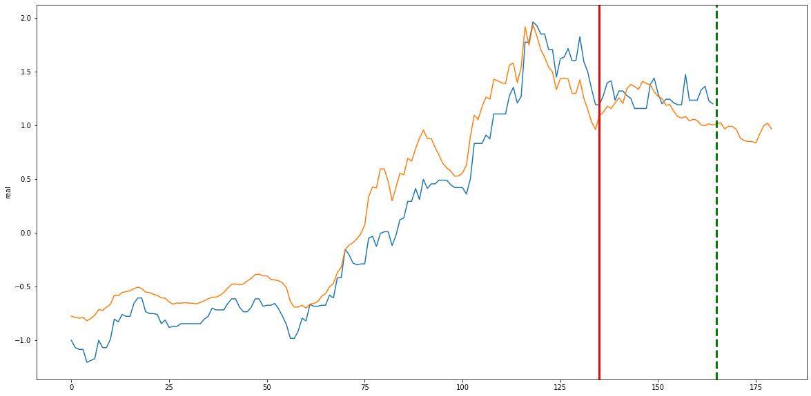
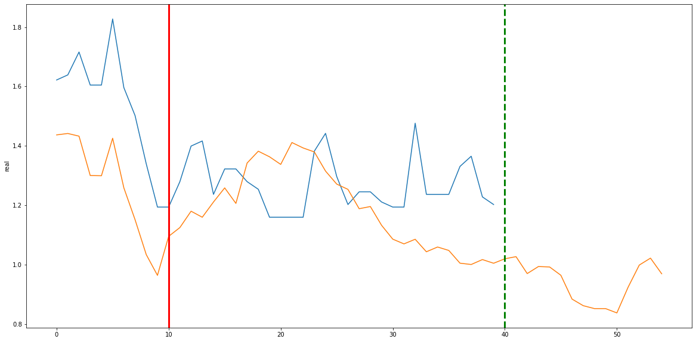

# GRU를 활용한 삼성전자 주가 동향 예측

## 필요한 모듈 가져오기


```python
import pandas as pd
import tensorflow as tf
import numpy as np
import seaborn as sns
import matplotlib.pyplot as plt
from datetime import datetime
import pandas_datareader.data as wb
from tensorflow.python.keras.callbacks import EarlyStopping
```

## 분석에 활용할 구글트렌드 데이터 가져오기
삼성전자와 삼전의 주요 경쟁자인 애플관련 검색어를 뽑아 가져왔습니다.
* 검색어 : apple, samsung, iphone, galaxy


```python
multi = pd.read_excel('multiTimeline.xlsx')
multi.index = multi['주']
del multi['주']
multi
```


<div>
<style scoped>
    .dataframe tbody tr th:only-of-type {
        vertical-align: middle;
    }

    .dataframe tbody tr th {
        vertical-align: top;
    }

    .dataframe thead th {
        text-align: right;
    }
</style>
<table border="1" class="dataframe">
  <thead>
    <tr style="text-align: right;">
      <th></th>
      <th>apple: (전 세계)</th>
      <th>samsung: (전 세계)</th>
      <th>iphone: (전 세계)</th>
      <th>galaxy: (전 세계)</th>
    </tr>
    <tr>
      <th>주</th>
      <th></th>
      <th></th>
      <th></th>
      <th></th>
    </tr>
  </thead>
  <tbody>
    <tr>
      <th>2016-03-06</th>
      <td>18</td>
      <td>38</td>
      <td>42</td>
      <td>22</td>
    </tr>
    <tr>
      <th>2016-03-13</th>
      <td>19</td>
      <td>38</td>
      <td>42</td>
      <td>21</td>
    </tr>
    <tr>
      <th>2016-03-20</th>
      <td>27</td>
      <td>39</td>
      <td>60</td>
      <td>21</td>
    </tr>
    <tr>
      <th>2016-03-27</th>
      <td>21</td>
      <td>37</td>
      <td>50</td>
      <td>20</td>
    </tr>
    <tr>
      <th>2016-04-03</th>
      <td>20</td>
      <td>36</td>
      <td>44</td>
      <td>19</td>
    </tr>
    <tr>
      <th>...</th>
      <td>...</td>
      <td>...</td>
      <td>...</td>
      <td>...</td>
    </tr>
    <tr>
      <th>2021-01-31</th>
      <td>24</td>
      <td>33</td>
      <td>38</td>
      <td>10</td>
    </tr>
    <tr>
      <th>2021-02-07</th>
      <td>21</td>
      <td>32</td>
      <td>38</td>
      <td>10</td>
    </tr>
    <tr>
      <th>2021-02-14</th>
      <td>21</td>
      <td>31</td>
      <td>37</td>
      <td>10</td>
    </tr>
    <tr>
      <th>2021-02-21</th>
      <td>21</td>
      <td>31</td>
      <td>37</td>
      <td>10</td>
    </tr>
    <tr>
      <th>2021-02-28</th>
      <td>21</td>
      <td>31</td>
      <td>36</td>
      <td>10</td>
    </tr>
  </tbody>
</table>
<p>261 rows × 4 columns</p>
</div>


## 야후에서 주가 데이터 가져오기

삼성전자를 비롯해 구글에 삼성전자 검색시 연관기업으로 나오는 애플, 현대자동차, tsmc 등의 주가 데이터와 원달러 환율데이터를 불러왔습니다.


```python
start = datetime(2016,3,13)
end = datetime(2021,3,5)

list = ['005930.KS','005935.KS',
        '066570.KS', 'AAPL', '000660.KS',
        'TSM', '006400.KS', '003550.KS',
        '009150.KS', '005380.KS', 'KRW=X']

df = wb.DataReader(list,'yahoo',start,end)
```

국내 증시와 해외증시의 쉬는날이 달라 거래가 이루어지지 않는 날에는 nan값이 발생하게 되어 fillna 함수를 사용해 forward filling 방식으로 결측치를 처리하였습니다.


```python
df = df.fillna(method='ffill')
df
```


<div>
<style scoped>
    .dataframe tbody tr th:only-of-type {
        vertical-align: middle;
    }

    .dataframe tbody tr th {
        vertical-align: top;
    }

    .dataframe thead tr th {
        text-align: left;
    }

    .dataframe thead tr:last-of-type th {
        text-align: right;
    }
</style>
<table border="1" class="dataframe">
  <thead>
    <tr>
      <th>Attributes</th>
      <th colspan="10" halign="left">Adj Close</th>
      <th>...</th>
      <th colspan="10" halign="left">Volume</th>
    </tr>
    <tr>
      <th>Symbols</th>
      <th>005930.KS</th>
      <th>005935.KS</th>
      <th>066570.KS</th>
      <th>AAPL</th>
      <th>000660.KS</th>
      <th>TSM</th>
      <th>006400.KS</th>
      <th>003550.KS</th>
      <th>009150.KS</th>
      <th>005380.KS</th>
      <th>...</th>
      <th>005935.KS</th>
      <th>066570.KS</th>
      <th>AAPL</th>
      <th>000660.KS</th>
      <th>TSM</th>
      <th>006400.KS</th>
      <th>003550.KS</th>
      <th>009150.KS</th>
      <th>005380.KS</th>
      <th>KRW=X</th>
    </tr>
    <tr>
      <th>Date</th>
      <th></th>
      <th></th>
      <th></th>
      <th></th>
      <th></th>
      <th></th>
      <th></th>
      <th></th>
      <th></th>
      <th></th>
      <th></th>
      <th></th>
      <th></th>
      <th></th>
      <th></th>
      <th></th>
      <th></th>
      <th></th>
      <th></th>
      <th></th>
      <th></th>
    </tr>
  </thead>
  <tbody>
    <tr>
      <th>2016-03-14</th>
      <td>21824.882812</td>
      <td>17808.912109</td>
      <td>59971.003906</td>
      <td>23.838688</td>
      <td>28216.279297</td>
      <td>21.124258</td>
      <td>96340.523438</td>
      <td>59793.937500</td>
      <td>55428.058594</td>
      <td>129723.593750</td>
      <td>...</td>
      <td>1036000.0</td>
      <td>904996.0</td>
      <td>100304400.0</td>
      <td>2062549.0</td>
      <td>4109400.0</td>
      <td>337511.0</td>
      <td>374438.0</td>
      <td>466569.0</td>
      <td>362075.0</td>
      <td>0.0</td>
    </tr>
    <tr>
      <th>2016-03-15</th>
      <td>21790.103516</td>
      <td>17622.873047</td>
      <td>58249.343750</td>
      <td>24.317701</td>
      <td>27797.914062</td>
      <td>20.839479</td>
      <td>95755.468750</td>
      <td>59264.011719</td>
      <td>55141.363281</td>
      <td>128413.265625</td>
      <td>...</td>
      <td>1829150.0</td>
      <td>1619247.0</td>
      <td>160270800.0</td>
      <td>2078857.0</td>
      <td>8839800.0</td>
      <td>180365.0</td>
      <td>299974.0</td>
      <td>306103.0</td>
      <td>309077.0</td>
      <td>0.0</td>
    </tr>
    <tr>
      <th>2016-03-16</th>
      <td>21842.273438</td>
      <td>17893.476562</td>
      <td>59205.824219</td>
      <td>24.640911</td>
      <td>27147.126953</td>
      <td>21.593315</td>
      <td>95852.968750</td>
      <td>60147.230469</td>
      <td>55332.496094</td>
      <td>127976.500000</td>
      <td>...</td>
      <td>1415800.0</td>
      <td>909767.0</td>
      <td>153214000.0</td>
      <td>2902896.0</td>
      <td>10874100.0</td>
      <td>79610.0</td>
      <td>260242.0</td>
      <td>302491.0</td>
      <td>206136.0</td>
      <td>0.0</td>
    </tr>
    <tr>
      <th>2016-03-17</th>
      <td>21964.005859</td>
      <td>17910.388672</td>
      <td>60066.648438</td>
      <td>24.601379</td>
      <td>27193.613281</td>
      <td>21.584942</td>
      <td>97023.101562</td>
      <td>60323.878906</td>
      <td>57434.929688</td>
      <td>127976.500000</td>
      <td>...</td>
      <td>2375800.0</td>
      <td>1028533.0</td>
      <td>137682800.0</td>
      <td>2768278.0</td>
      <td>6264700.0</td>
      <td>284336.0</td>
      <td>331516.0</td>
      <td>831928.0</td>
      <td>492380.0</td>
      <td>0.0</td>
    </tr>
    <tr>
      <th>2016-03-18</th>
      <td>22137.906250</td>
      <td>17978.035156</td>
      <td>60353.589844</td>
      <td>24.629284</td>
      <td>27379.550781</td>
      <td>21.811094</td>
      <td>97413.148438</td>
      <td>59352.335938</td>
      <td>57052.671875</td>
      <td>131470.734375</td>
      <td>...</td>
      <td>3698350.0</td>
      <td>904363.0</td>
      <td>176820800.0</td>
      <td>2864640.0</td>
      <td>7208700.0</td>
      <td>228622.0</td>
      <td>399772.0</td>
      <td>519273.0</td>
      <td>769047.0</td>
      <td>0.0</td>
    </tr>
    <tr>
      <th>...</th>
      <td>...</td>
      <td>...</td>
      <td>...</td>
      <td>...</td>
      <td>...</td>
      <td>...</td>
      <td>...</td>
      <td>...</td>
      <td>...</td>
      <td>...</td>
      <td>...</td>
      <td>...</td>
      <td>...</td>
      <td>...</td>
      <td>...</td>
      <td>...</td>
      <td>...</td>
      <td>...</td>
      <td>...</td>
      <td>...</td>
      <td>...</td>
    </tr>
    <tr>
      <th>2021-03-01</th>
      <td>82500.000000</td>
      <td>72800.000000</td>
      <td>146500.000000</td>
      <td>127.790001</td>
      <td>141500.000000</td>
      <td>129.130005</td>
      <td>674000.000000</td>
      <td>93900.000000</td>
      <td>189500.000000</td>
      <td>237000.000000</td>
      <td>...</td>
      <td>3602803.0</td>
      <td>2453529.0</td>
      <td>115998300.0</td>
      <td>10843268.0</td>
      <td>9691100.0</td>
      <td>579115.0</td>
      <td>833466.0</td>
      <td>629682.0</td>
      <td>2710962.0</td>
      <td>0.0</td>
    </tr>
    <tr>
      <th>2021-03-02</th>
      <td>83600.000000</td>
      <td>73100.000000</td>
      <td>149000.000000</td>
      <td>125.120003</td>
      <td>144500.000000</td>
      <td>126.000000</td>
      <td>684000.000000</td>
      <td>93300.000000</td>
      <td>201500.000000</td>
      <td>239000.000000</td>
      <td>...</td>
      <td>2939705.0</td>
      <td>1552321.0</td>
      <td>102015300.0</td>
      <td>9376523.0</td>
      <td>8249300.0</td>
      <td>579401.0</td>
      <td>531938.0</td>
      <td>1104639.0</td>
      <td>2509152.0</td>
      <td>0.0</td>
    </tr>
    <tr>
      <th>2021-03-03</th>
      <td>84000.000000</td>
      <td>73900.000000</td>
      <td>150500.000000</td>
      <td>122.059998</td>
      <td>147000.000000</td>
      <td>122.889999</td>
      <td>696000.000000</td>
      <td>94200.000000</td>
      <td>202000.000000</td>
      <td>240000.000000</td>
      <td>...</td>
      <td>1435952.0</td>
      <td>1033609.0</td>
      <td>112430400.0</td>
      <td>5827221.0</td>
      <td>10622300.0</td>
      <td>309191.0</td>
      <td>334415.0</td>
      <td>505832.0</td>
      <td>910872.0</td>
      <td>0.0</td>
    </tr>
    <tr>
      <th>2021-03-04</th>
      <td>82400.000000</td>
      <td>73100.000000</td>
      <td>146000.000000</td>
      <td>120.129997</td>
      <td>142000.000000</td>
      <td>115.589996</td>
      <td>678000.000000</td>
      <td>92000.000000</td>
      <td>194500.000000</td>
      <td>235000.000000</td>
      <td>...</td>
      <td>1654441.0</td>
      <td>1342531.0</td>
      <td>177275300.0</td>
      <td>6586562.0</td>
      <td>24364000.0</td>
      <td>370526.0</td>
      <td>460670.0</td>
      <td>638690.0</td>
      <td>1274581.0</td>
      <td>0.0</td>
    </tr>
    <tr>
      <th>2021-03-05</th>
      <td>82100.000000</td>
      <td>72200.000000</td>
      <td>148500.000000</td>
      <td>120.129997</td>
      <td>140000.000000</td>
      <td>115.589996</td>
      <td>671000.000000</td>
      <td>90800.000000</td>
      <td>195000.000000</td>
      <td>235000.000000</td>
      <td>...</td>
      <td>2697504.0</td>
      <td>1468448.0</td>
      <td>177275300.0</td>
      <td>6042772.0</td>
      <td>24364000.0</td>
      <td>427126.0</td>
      <td>384393.0</td>
      <td>506103.0</td>
      <td>1142704.0</td>
      <td>0.0</td>
    </tr>
  </tbody>
</table>
<p>1449 rows × 66 columns</p>
</div>


주식데이터와 구글트렌드 데이터를 합치고 구글 트렌드 데이터에 대한 결측치를 다시 forward filling으로 채워 넣었습니다.


```python
dff = pd.merge(df,multi, left_index=True, right_index=True, how='outer').fillna(method='ffill').iloc[-200:,:]
df = dff
df
```

    C:\Users\Sunwoo\anaconda3\lib\site-packages\pandas\core\reshape\merge.py:643: UserWarning: merging between different levels can give an unintended result (2 levels on the left,1 on the right)
      warnings.warn(msg, UserWarning)
    


<div>
<style scoped>
    .dataframe tbody tr th:only-of-type {
        vertical-align: middle;
    }

    .dataframe tbody tr th {
        vertical-align: top;
    }

    .dataframe thead th {
        text-align: right;
    }
</style>
<table border="1" class="dataframe">
  <thead>
    <tr style="text-align: right;">
      <th></th>
      <th>(Adj Close, 005930.KS)</th>
      <th>(Adj Close, 005935.KS)</th>
      <th>(Adj Close, 066570.KS)</th>
      <th>(Adj Close, AAPL)</th>
      <th>(Adj Close, 000660.KS)</th>
      <th>(Adj Close, TSM)</th>
      <th>(Adj Close, 006400.KS)</th>
      <th>(Adj Close, 003550.KS)</th>
      <th>(Adj Close, 009150.KS)</th>
      <th>(Adj Close, 005380.KS)</th>
      <th>...</th>
      <th>(Volume, TSM)</th>
      <th>(Volume, 006400.KS)</th>
      <th>(Volume, 003550.KS)</th>
      <th>(Volume, 009150.KS)</th>
      <th>(Volume, 005380.KS)</th>
      <th>(Volume, KRW=X)</th>
      <th>apple: (전 세계)</th>
      <th>samsung: (전 세계)</th>
      <th>iphone: (전 세계)</th>
      <th>galaxy: (전 세계)</th>
    </tr>
  </thead>
  <tbody>
    <tr>
      <th>2020-07-16</th>
      <td>52158.406250</td>
      <td>45482.628906</td>
      <td>73781.929688</td>
      <td>96.039330</td>
      <td>81862.257812</td>
      <td>65.969612</td>
      <td>385309.46875</td>
      <td>71305.250000</td>
      <td>125938.507812</td>
      <td>108258.578125</td>
      <td>...</td>
      <td>15709400.0</td>
      <td>425923.0</td>
      <td>237423.0</td>
      <td>474043.0</td>
      <td>3254530.0</td>
      <td>0.0</td>
      <td>23.0</td>
      <td>35.0</td>
      <td>40.0</td>
      <td>11.0</td>
    </tr>
    <tr>
      <th>2020-07-17</th>
      <td>52740.101562</td>
      <td>45530.964844</td>
      <td>74970.359375</td>
      <td>95.845299</td>
      <td>82060.234375</td>
      <td>65.781387</td>
      <td>382813.93750</td>
      <td>70139.500000</td>
      <td>129905.078125</td>
      <td>115639.843750</td>
      <td>...</td>
      <td>11716600.0</td>
      <td>357349.0</td>
      <td>166315.0</td>
      <td>700429.0</td>
      <td>4265529.0</td>
      <td>0.0</td>
      <td>23.0</td>
      <td>35.0</td>
      <td>40.0</td>
      <td>11.0</td>
    </tr>
    <tr>
      <th>2020-07-19</th>
      <td>52740.101562</td>
      <td>45530.964844</td>
      <td>74970.359375</td>
      <td>95.845299</td>
      <td>82060.234375</td>
      <td>65.781387</td>
      <td>382813.93750</td>
      <td>70139.500000</td>
      <td>129905.078125</td>
      <td>115639.843750</td>
      <td>...</td>
      <td>11716600.0</td>
      <td>357349.0</td>
      <td>166315.0</td>
      <td>700429.0</td>
      <td>4265529.0</td>
      <td>0.0</td>
      <td>24.0</td>
      <td>36.0</td>
      <td>41.0</td>
      <td>12.0</td>
    </tr>
    <tr>
      <th>2020-07-20</th>
      <td>52546.203125</td>
      <td>45385.960938</td>
      <td>75267.468750</td>
      <td>97.865143</td>
      <td>81367.328125</td>
      <td>66.266823</td>
      <td>377822.90625</td>
      <td>69750.914062</td>
      <td>129905.078125</td>
      <td>119576.523438</td>
      <td>...</td>
      <td>6357300.0</td>
      <td>258083.0</td>
      <td>134809.0</td>
      <td>399274.0</td>
      <td>4461527.0</td>
      <td>0.0</td>
      <td>24.0</td>
      <td>36.0</td>
      <td>41.0</td>
      <td>12.0</td>
    </tr>
    <tr>
      <th>2020-07-21</th>
      <td>53612.636719</td>
      <td>46110.972656</td>
      <td>74178.070312</td>
      <td>96.514442</td>
      <td>83248.078125</td>
      <td>67.178246</td>
      <td>386307.68750</td>
      <td>70139.500000</td>
      <td>135359.109375</td>
      <td>119576.523438</td>
      <td>...</td>
      <td>10621300.0</td>
      <td>392214.0</td>
      <td>308056.0</td>
      <td>1092107.0</td>
      <td>3138553.0</td>
      <td>0.0</td>
      <td>24.0</td>
      <td>36.0</td>
      <td>41.0</td>
      <td>12.0</td>
    </tr>
    <tr>
      <th>...</th>
      <td>...</td>
      <td>...</td>
      <td>...</td>
      <td>...</td>
      <td>...</td>
      <td>...</td>
      <td>...</td>
      <td>...</td>
      <td>...</td>
      <td>...</td>
      <td>...</td>
      <td>...</td>
      <td>...</td>
      <td>...</td>
      <td>...</td>
      <td>...</td>
      <td>...</td>
      <td>...</td>
      <td>...</td>
      <td>...</td>
      <td>...</td>
    </tr>
    <tr>
      <th>2021-03-01</th>
      <td>82500.000000</td>
      <td>72800.000000</td>
      <td>146500.000000</td>
      <td>127.790001</td>
      <td>141500.000000</td>
      <td>129.130005</td>
      <td>674000.00000</td>
      <td>93900.000000</td>
      <td>189500.000000</td>
      <td>237000.000000</td>
      <td>...</td>
      <td>9691100.0</td>
      <td>579115.0</td>
      <td>833466.0</td>
      <td>629682.0</td>
      <td>2710962.0</td>
      <td>0.0</td>
      <td>21.0</td>
      <td>31.0</td>
      <td>36.0</td>
      <td>10.0</td>
    </tr>
    <tr>
      <th>2021-03-02</th>
      <td>83600.000000</td>
      <td>73100.000000</td>
      <td>149000.000000</td>
      <td>125.120003</td>
      <td>144500.000000</td>
      <td>126.000000</td>
      <td>684000.00000</td>
      <td>93300.000000</td>
      <td>201500.000000</td>
      <td>239000.000000</td>
      <td>...</td>
      <td>8249300.0</td>
      <td>579401.0</td>
      <td>531938.0</td>
      <td>1104639.0</td>
      <td>2509152.0</td>
      <td>0.0</td>
      <td>21.0</td>
      <td>31.0</td>
      <td>36.0</td>
      <td>10.0</td>
    </tr>
    <tr>
      <th>2021-03-03</th>
      <td>84000.000000</td>
      <td>73900.000000</td>
      <td>150500.000000</td>
      <td>122.059998</td>
      <td>147000.000000</td>
      <td>122.889999</td>
      <td>696000.00000</td>
      <td>94200.000000</td>
      <td>202000.000000</td>
      <td>240000.000000</td>
      <td>...</td>
      <td>10622300.0</td>
      <td>309191.0</td>
      <td>334415.0</td>
      <td>505832.0</td>
      <td>910872.0</td>
      <td>0.0</td>
      <td>21.0</td>
      <td>31.0</td>
      <td>36.0</td>
      <td>10.0</td>
    </tr>
    <tr>
      <th>2021-03-04</th>
      <td>82400.000000</td>
      <td>73100.000000</td>
      <td>146000.000000</td>
      <td>120.129997</td>
      <td>142000.000000</td>
      <td>115.589996</td>
      <td>678000.00000</td>
      <td>92000.000000</td>
      <td>194500.000000</td>
      <td>235000.000000</td>
      <td>...</td>
      <td>24364000.0</td>
      <td>370526.0</td>
      <td>460670.0</td>
      <td>638690.0</td>
      <td>1274581.0</td>
      <td>0.0</td>
      <td>21.0</td>
      <td>31.0</td>
      <td>36.0</td>
      <td>10.0</td>
    </tr>
    <tr>
      <th>2021-03-05</th>
      <td>82100.000000</td>
      <td>72200.000000</td>
      <td>148500.000000</td>
      <td>120.129997</td>
      <td>140000.000000</td>
      <td>115.589996</td>
      <td>671000.00000</td>
      <td>90800.000000</td>
      <td>195000.000000</td>
      <td>235000.000000</td>
      <td>...</td>
      <td>24364000.0</td>
      <td>427126.0</td>
      <td>384393.0</td>
      <td>506103.0</td>
      <td>1142704.0</td>
      <td>0.0</td>
      <td>21.0</td>
      <td>31.0</td>
      <td>36.0</td>
      <td>10.0</td>
    </tr>
  </tbody>
</table>
<p>200 rows × 70 columns</p>
</div>


## standard scaler를 이용한 표준화 작업진행
z-score를 사용하여 데이터를 전처리합니다.


```python
from sklearn.preprocessing import StandardScaler, MinMaxScaler

scaler = StandardScaler()
df_scaled = scaler.fit_transform(df)
df_scaled = pd.DataFrame(df_scaled)

df_scaled.columns = df.columns

df_scaled
```


<div>
<style scoped>
    .dataframe tbody tr th:only-of-type {
        vertical-align: middle;
    }

    .dataframe tbody tr th {
        vertical-align: top;
    }

    .dataframe thead th {
        text-align: right;
    }
</style>
<table border="1" class="dataframe">
  <thead>
    <tr style="text-align: right;">
      <th></th>
      <th>(Adj Close, 005930.KS)</th>
      <th>(Adj Close, 005935.KS)</th>
      <th>(Adj Close, 066570.KS)</th>
      <th>(Adj Close, AAPL)</th>
      <th>(Adj Close, 000660.KS)</th>
      <th>(Adj Close, TSM)</th>
      <th>(Adj Close, 006400.KS)</th>
      <th>(Adj Close, 003550.KS)</th>
      <th>(Adj Close, 009150.KS)</th>
      <th>(Adj Close, 005380.KS)</th>
      <th>...</th>
      <th>(Volume, TSM)</th>
      <th>(Volume, 006400.KS)</th>
      <th>(Volume, 003550.KS)</th>
      <th>(Volume, 009150.KS)</th>
      <th>(Volume, 005380.KS)</th>
      <th>(Volume, KRW=X)</th>
      <th>apple: (전 세계)</th>
      <th>samsung: (전 세계)</th>
      <th>iphone: (전 세계)</th>
      <th>galaxy: (전 세계)</th>
    </tr>
  </thead>
  <tbody>
    <tr>
      <th>0</th>
      <td>-1.192908</td>
      <td>-1.184091</td>
      <td>-1.029844</td>
      <td>-2.225451</td>
      <td>-0.829620</td>
      <td>-1.561771</td>
      <td>-1.189173</td>
      <td>-0.854454</td>
      <td>-1.186261</td>
      <td>-2.097405</td>
      <td>...</td>
      <td>0.804722</td>
      <td>-0.285710</td>
      <td>-0.481097</td>
      <td>-0.566572</td>
      <td>0.235816</td>
      <td>0.0</td>
      <td>-0.883996</td>
      <td>0.178706</td>
      <td>-0.576519</td>
      <td>-0.108989</td>
    </tr>
    <tr>
      <th>1</th>
      <td>-1.145752</td>
      <td>-1.179978</td>
      <td>-0.992964</td>
      <td>-2.243305</td>
      <td>-0.820812</td>
      <td>-1.570993</td>
      <td>-1.207993</td>
      <td>-0.943124</td>
      <td>-1.043177</td>
      <td>-1.901580</td>
      <td>...</td>
      <td>0.171619</td>
      <td>-0.557253</td>
      <td>-0.591477</td>
      <td>0.065749</td>
      <td>0.667413</td>
      <td>0.0</td>
      <td>-0.883996</td>
      <td>0.178706</td>
      <td>-0.576519</td>
      <td>-0.108989</td>
    </tr>
    <tr>
      <th>2</th>
      <td>-1.145752</td>
      <td>-1.179978</td>
      <td>-0.992964</td>
      <td>-2.243305</td>
      <td>-0.820812</td>
      <td>-1.570993</td>
      <td>-1.207993</td>
      <td>-0.943124</td>
      <td>-1.043177</td>
      <td>-1.901580</td>
      <td>...</td>
      <td>0.171619</td>
      <td>-0.557253</td>
      <td>-0.591477</td>
      <td>0.065749</td>
      <td>0.667413</td>
      <td>0.0</td>
      <td>-0.608608</td>
      <td>0.604195</td>
      <td>-0.415029</td>
      <td>1.101999</td>
    </tr>
    <tr>
      <th>3</th>
      <td>-1.161471</td>
      <td>-1.192317</td>
      <td>-0.983745</td>
      <td>-2.057447</td>
      <td>-0.851638</td>
      <td>-1.547210</td>
      <td>-1.245632</td>
      <td>-0.972681</td>
      <td>-1.043177</td>
      <td>-1.797139</td>
      <td>...</td>
      <td>-0.678157</td>
      <td>-0.950332</td>
      <td>-0.640383</td>
      <td>-0.775410</td>
      <td>0.751085</td>
      <td>0.0</td>
      <td>-0.608608</td>
      <td>0.604195</td>
      <td>-0.415029</td>
      <td>1.101999</td>
    </tr>
    <tr>
      <th>4</th>
      <td>-1.075018</td>
      <td>-1.130624</td>
      <td>-1.017551</td>
      <td>-2.181733</td>
      <td>-0.767967</td>
      <td>-1.502555</td>
      <td>-1.181645</td>
      <td>-0.943124</td>
      <td>-0.846436</td>
      <td>-1.797139</td>
      <td>...</td>
      <td>-0.002053</td>
      <td>-0.419193</td>
      <td>-0.371455</td>
      <td>1.159750</td>
      <td>0.186305</td>
      <td>0.0</td>
      <td>-0.608608</td>
      <td>0.604195</td>
      <td>-0.415029</td>
      <td>1.101999</td>
    </tr>
    <tr>
      <th>...</th>
      <td>...</td>
      <td>...</td>
      <td>...</td>
      <td>...</td>
      <td>...</td>
      <td>...</td>
      <td>...</td>
      <td>...</td>
      <td>...</td>
      <td>...</td>
      <td>...</td>
      <td>...</td>
      <td>...</td>
      <td>...</td>
      <td>...</td>
      <td>...</td>
      <td>...</td>
      <td>...</td>
      <td>...</td>
      <td>...</td>
      <td>...</td>
    </tr>
    <tr>
      <th>195</th>
      <td>1.266793</td>
      <td>1.140414</td>
      <td>1.226755</td>
      <td>0.696130</td>
      <td>1.823553</td>
      <td>1.532741</td>
      <td>0.987933</td>
      <td>0.864159</td>
      <td>1.106566</td>
      <td>1.318109</td>
      <td>...</td>
      <td>-0.149546</td>
      <td>0.320908</td>
      <td>0.444128</td>
      <td>-0.131855</td>
      <td>0.003766</td>
      <td>0.0</td>
      <td>-1.434772</td>
      <td>-1.523253</td>
      <td>-1.222478</td>
      <td>-1.319976</td>
    </tr>
    <tr>
      <th>196</th>
      <td>1.355966</td>
      <td>1.165942</td>
      <td>1.304336</td>
      <td>0.450446</td>
      <td>1.957017</td>
      <td>1.379388</td>
      <td>1.063346</td>
      <td>0.818522</td>
      <td>1.539437</td>
      <td>1.371169</td>
      <td>...</td>
      <td>-0.378159</td>
      <td>0.322041</td>
      <td>-0.023927</td>
      <td>1.194753</td>
      <td>-0.082387</td>
      <td>0.0</td>
      <td>-1.434772</td>
      <td>-1.523253</td>
      <td>-1.222478</td>
      <td>-1.319976</td>
    </tr>
    <tr>
      <th>197</th>
      <td>1.388393</td>
      <td>1.234016</td>
      <td>1.350884</td>
      <td>0.168876</td>
      <td>2.068238</td>
      <td>1.227015</td>
      <td>1.153842</td>
      <td>0.886978</td>
      <td>1.557474</td>
      <td>1.397699</td>
      <td>...</td>
      <td>-0.001894</td>
      <td>-0.747952</td>
      <td>-0.330538</td>
      <td>-0.477782</td>
      <td>-0.764695</td>
      <td>0.0</td>
      <td>-1.434772</td>
      <td>-1.523253</td>
      <td>-1.222478</td>
      <td>-1.319976</td>
    </tr>
    <tr>
      <th>198</th>
      <td>1.258686</td>
      <td>1.165942</td>
      <td>1.211239</td>
      <td>-0.008716</td>
      <td>1.845797</td>
      <td>0.869355</td>
      <td>1.018098</td>
      <td>0.719640</td>
      <td>1.286929</td>
      <td>1.265049</td>
      <td>...</td>
      <td>2.177005</td>
      <td>-0.505074</td>
      <td>-0.134555</td>
      <td>-0.106695</td>
      <td>-0.609427</td>
      <td>0.0</td>
      <td>-1.434772</td>
      <td>-1.523253</td>
      <td>-1.222478</td>
      <td>-1.319976</td>
    </tr>
    <tr>
      <th>199</th>
      <td>1.234366</td>
      <td>1.089359</td>
      <td>1.288820</td>
      <td>-0.008716</td>
      <td>1.756821</td>
      <td>0.869355</td>
      <td>0.965309</td>
      <td>0.628365</td>
      <td>1.304965</td>
      <td>1.265049</td>
      <td>...</td>
      <td>2.177005</td>
      <td>-0.280946</td>
      <td>-0.252959</td>
      <td>-0.477025</td>
      <td>-0.665726</td>
      <td>0.0</td>
      <td>-1.434772</td>
      <td>-1.523253</td>
      <td>-1.222478</td>
      <td>-1.319976</td>
    </tr>
  </tbody>
</table>
<p>200 rows × 70 columns</p>
</div>


## GRU 모델을 사용하기 위한 자료형 변환
x데이터를 rank 3의 numpy array로 변환하였습니다.


```python
# 며칠후를 예측할지, 테스트 기간, 예측에 사용할 과거 기록(일)
forecast = 15
TEST_SIZE = 30
WINDOW_SIZE = 20
VALID_SIZE = 70

# GRU를 사용해 간단하게 주가를 예측할 생각입니다.
# RNN 기반 모델에 투입 가능한 데이터셋 형태를 만들기 위해서는 시계열을 이리찢고 저리찢어야합니다...

def make_dataset(data, window_size):
    feature_list = []
    for i in range(len(data) - window_size):
        feature_list.append(np.array(data.iloc[i:i+window_size]))
    return np.array(feature_list)

x = make_dataset(df_scaled, WINDOW_SIZE)[:-forecast]
y = df_scaled.iloc[forecast+WINDOW_SIZE:,:]['Close', '005930.KS'].values

x.shape, y.shape
```


    ((165, 20, 70), (165,))


x데이터와 y데이터를 기간에 따라 train, validation, test로 분할하였습니다.


```python
x_train = x[:-TEST_SIZE]
x_test = x[-TEST_SIZE:]
x_val = x[-VALID_SIZE-TEST_SIZE:-TEST_SIZE]

y_train = y[:-TEST_SIZE]
y_test = y[-TEST_SIZE:]
y_val = y[-VALID_SIZE-TEST_SIZE:-TEST_SIZE]

x_train.shape, y_train.shape, x_test.shape, y_test.shape, x_val.shape, y_val.shape 
```


    ((135, 20, 70), (135,), (30, 20, 70), (30,), (70, 20, 70), (70,))


## GRU 모델 구축


```python
from keras.models import Sequential
from keras.layers import Dense
from keras.callbacks import EarlyStopping
from keras.layers import GRU

model = Sequential()
model.add(GRU(units = 1024, input_shape=(x_train.shape[1], x_train.shape[2]), activation='tanh', return_sequences=True))
model.add(GRU(units = 512, activation='tanh', dropout=0.01, return_sequences=True))
model.add(GRU(units = 256, activation='tanh', dropout=0.01, return_sequences=True))
model.add(GRU(units = 256, activation='tanh', dropout=0.01, return_sequences=False))
model.add(Dense(1))

model.summary()
```

    Model: "sequential"
    _________________________________________________________________
    Layer (type)                 Output Shape              Param #   
    =================================================================
    gru (GRU)                    (None, 20, 1024)          3366912   
    _________________________________________________________________
    gru_1 (GRU)                  (None, 20, 512)           2362368   
    _________________________________________________________________
    gru_2 (GRU)                  (None, 20, 256)           591360    
    _________________________________________________________________
    gru_3 (GRU)                  (None, 256)               394752    
    _________________________________________________________________
    dense (Dense)                (None, 1)                 257       
    =================================================================
    Total params: 6,715,649
    Trainable params: 6,715,649
    Non-trainable params: 0
    _________________________________________________________________
    

## 학습 진행
처음에는 EarlyStopping을 적용하여 학습하였는데, train 데이터와 test 데이터 간의 loss, mae 차이가 너무 크게 나타났습니다.
그 둘이 비슷해지는 구간인 epoch=11 에서 학습을 다시 진행하였습니다.


```python
# 학습을 진행중입니다.
model.compile(loss='mean_squared_error', optimizer='adam', metrics=['mae'])

early_stopping = EarlyStopping(monitor='val_loss', mode='min', verbose=1, patience=20)
history = model.fit(x_train, y_train, epochs=11, batch_size=256, validation_data=(x_test, y_test))
#history = model.fit(x_train, y_train, epochs=2000, batch_size=256, validation_data=(x_test, y_test), callbacks=[early_stopping])
```

    Epoch 1/11
    1/1 [==============================] - 6s 6s/step - loss: 0.0102 - mae: 0.0786 - val_loss: 1.0962 - val_mae: 1.0406
    Epoch 2/11
    1/1 [==============================] - 0s 70ms/step - loss: 0.3518 - mae: 0.4755 - val_loss: 1.3228 - val_mae: 1.1460
    Epoch 3/11
    1/1 [==============================] - 0s 69ms/step - loss: 1.3704 - mae: 1.0639 - val_loss: 0.0554 - val_mae: 0.2107
    Epoch 4/11
    1/1 [==============================] - 0s 70ms/step - loss: 0.1469 - mae: 0.3461 - val_loss: 0.2687 - val_mae: 0.4996
    Epoch 5/11
    1/1 [==============================] - 0s 70ms/step - loss: 0.1221 - mae: 0.3075 - val_loss: 0.1902 - val_mae: 0.3778
    Epoch 6/11
    1/1 [==============================] - 0s 70ms/step - loss: 0.0743 - mae: 0.2457 - val_loss: 0.3567 - val_mae: 0.5386
    Epoch 7/11
    1/1 [==============================] - 0s 69ms/step - loss: 0.1900 - mae: 0.3736 - val_loss: 0.0488 - val_mae: 0.1874
    Epoch 8/11
    1/1 [==============================] - 0s 71ms/step - loss: 0.0613 - mae: 0.1915 - val_loss: 0.2076 - val_mae: 0.4223
    Epoch 9/11
    1/1 [==============================] - 0s 72ms/step - loss: 0.1244 - mae: 0.2987 - val_loss: 0.1023 - val_mae: 0.2687
    Epoch 10/11
    1/1 [==============================] - 0s 73ms/step - loss: 0.0339 - mae: 0.1502 - val_loss: 0.0326 - val_mae: 0.1459
    Epoch 11/11
    1/1 [==============================] - 0s 69ms/step - loss: 0.0399 - mae: 0.1678 - val_loss: 0.0338 - val_mae: 0.1555
    

## 정답 발표!
예측데이터와 실제데이터를 데이터프레임으로 불러와봤습니다.


```python
full_x = make_dataset(df_scaled, WINDOW_SIZE)
data = pd.DataFrame(model.predict(full_x))
data['real'] = pd.DataFrame(y).reset_index(drop=True)
data['pred'] = pd.DataFrame(model.predict(full_x))
data
```


<div>
<style scoped>
    .dataframe tbody tr th:only-of-type {
        vertical-align: middle;
    }

    .dataframe tbody tr th {
        vertical-align: top;
    }

    .dataframe thead th {
        text-align: right;
    }
</style>
<table border="1" class="dataframe">
  <thead>
    <tr style="text-align: right;">
      <th></th>
      <th>0</th>
      <th>real</th>
      <th>pred</th>
    </tr>
  </thead>
  <tbody>
    <tr>
      <th>0</th>
      <td>-0.774032</td>
      <td>-0.997399</td>
      <td>-0.774032</td>
    </tr>
    <tr>
      <th>1</th>
      <td>-0.784051</td>
      <td>-1.065878</td>
      <td>-0.784051</td>
    </tr>
    <tr>
      <th>2</th>
      <td>-0.792066</td>
      <td>-1.082998</td>
      <td>-0.792066</td>
    </tr>
    <tr>
      <th>3</th>
      <td>-0.783824</td>
      <td>-1.082998</td>
      <td>-0.783824</td>
    </tr>
    <tr>
      <th>4</th>
      <td>-0.815866</td>
      <td>-1.202837</td>
      <td>-0.815866</td>
    </tr>
    <tr>
      <th>...</th>
      <td>...</td>
      <td>...</td>
      <td>...</td>
    </tr>
    <tr>
      <th>175</th>
      <td>0.837488</td>
      <td>NaN</td>
      <td>0.837488</td>
    </tr>
    <tr>
      <th>176</th>
      <td>0.923849</td>
      <td>NaN</td>
      <td>0.923849</td>
    </tr>
    <tr>
      <th>177</th>
      <td>0.998610</td>
      <td>NaN</td>
      <td>0.998610</td>
    </tr>
    <tr>
      <th>178</th>
      <td>1.021956</td>
      <td>NaN</td>
      <td>1.021956</td>
    </tr>
    <tr>
      <th>179</th>
      <td>0.969296</td>
      <td>NaN</td>
      <td>0.969296</td>
    </tr>
  </tbody>
</table>
<p>180 rows × 3 columns</p>
</div>


## 학습데이터를 잘 학습했는지 확인해 보겠습니다.

* 붉은 직선 이전 : train dataset
* 붉은 직선 이후 : test dataset
* 녹색 점선 이후 : 향후 동향(영업일 기준 15일)

과적합이 안되도록 epoch를 낮췄더니 흐름만 적당히 따라가는 양상입니다.
해당 분석대로라면 향후 삼성전자 주가는 당분간 내려갈 전망으로 보입니다.


```python
plt.figure(figsize=(20, 10))
sns.lineplot(data=data, x= data.index, y=data.columns[1])
sns.lineplot(data=data, x= data.index, y=data.columns[2])
plt.axvline(x=data.shape[0]-forecast, color='g', linestyle='--', linewidth=3)
plt.axvline(x=data.shape[0]-forecast-TEST_SIZE, color='r', linestyle='-', linewidth=3)
plt.legend
```


    <function matplotlib.pyplot.legend(*args, **kwargs)>





## 붉은선 이후를 확대하여 확인


```python
data1 = data[data.shape[0]-forecast-TEST_SIZE-10:].reset_index(drop=True)

plt.figure(figsize=(20, 10))
sns.lineplot(data=data1, x= data1.index, y=data1.columns[1])
sns.lineplot(data=data1, x= data1.index, y=data1.columns[2])
plt.axvline(x=data1.shape[0]-forecast, color='g', linestyle='--', linewidth=3)
plt.axvline(x=data1.shape[0]-forecast-TEST_SIZE, color='r', linestyle='-', linewidth=3)
plt.legend
```


    <function matplotlib.pyplot.legend(*args, **kwargs)>




